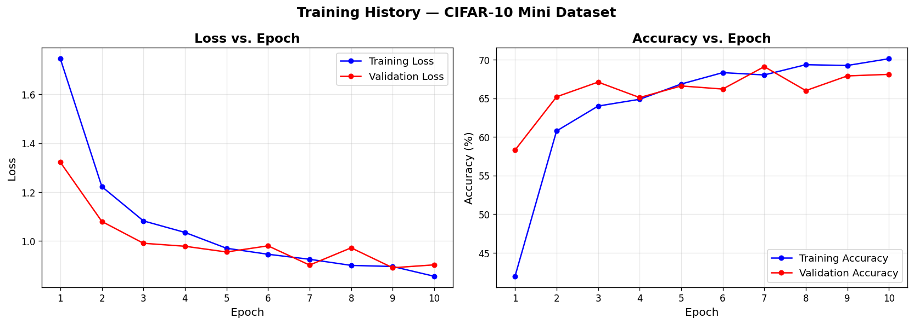
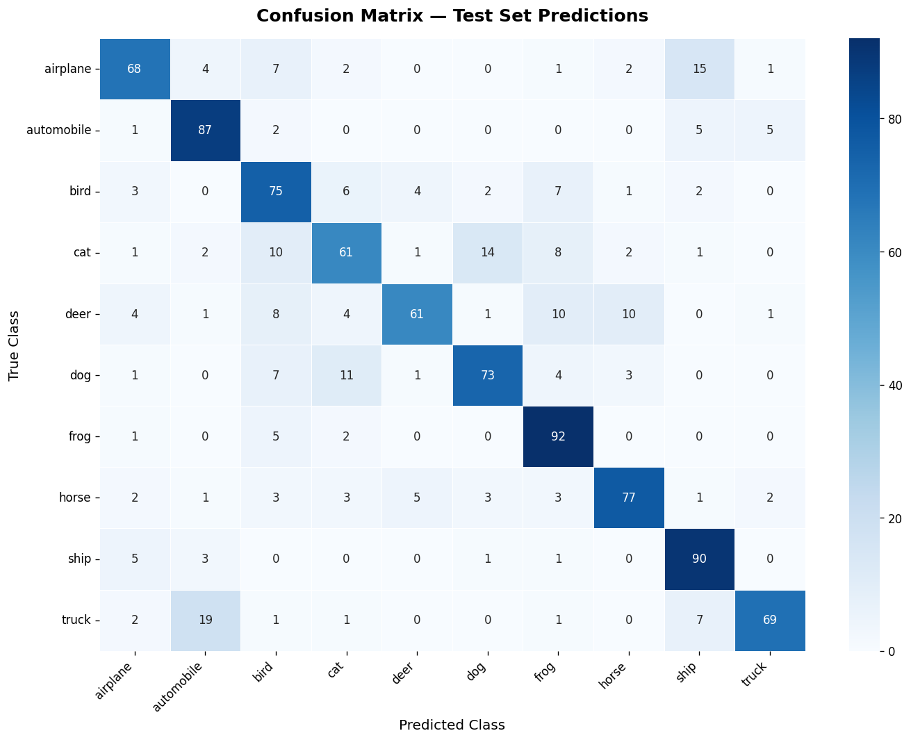

# CIFAR-10 Mini Image Classifier
## Transfer Learning with ResNet18 and PyTorch

## Results
- Test Accuracy: **75.30%**
- Training time: ~3 minutes on Kaggle GPU T4
- Dataset: CIFAR-10 Mini (5,000 images, 10 classes)

## Model Architecture
- Base model  : ResNet18 pretrained on ImageNet
- Strategy    : Feature extraction (all layers frozen except final fc)
- Output layer: Linear(512 → 10 classes)
- Parameters  : 5,130 trainable / 11.2M total

## Dataset
CIFAR-10 Mini — 500 images per class × 10 classes = 5,000 images
| Split      | Images |
|------------|--------|
| Training   | 4,000  |
| Validation | 1,000  |
| Test       | 1,000  |

**Classes:** airplane, automobile, bird, cat, deer, dog, frog, horse, ship, truck

## Training Settings
| Setting       | Value              |
|---------------|--------------------|
| Epochs        | 10                 |
| Batch size    | 32                 |
| Optimiser     | Adam (lr=0.001)    |
| Loss function | CrossEntropyLoss   |
| Scheduler     | ReduceLROnPlateau  |

## Results Visualisation

## Reflection
- Most challenging part: Setting up the GPU environment on Kaggle
- Most confused class pair: truck → automobile (19 times)
- How I would improve this: Train on full 60,000 image dataset

## How to Run
1. Open Kaggle Notebook
2. Enable GPU: Settings → Accelerator → GPU T4
3. Run all cells in order

## Requirements
PyTorch | torchvision | scikit-learn | seaborn | matplotlib | Pillow
